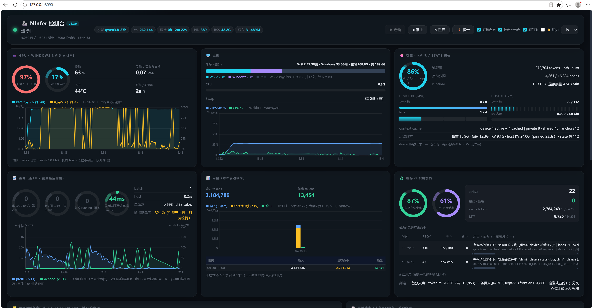
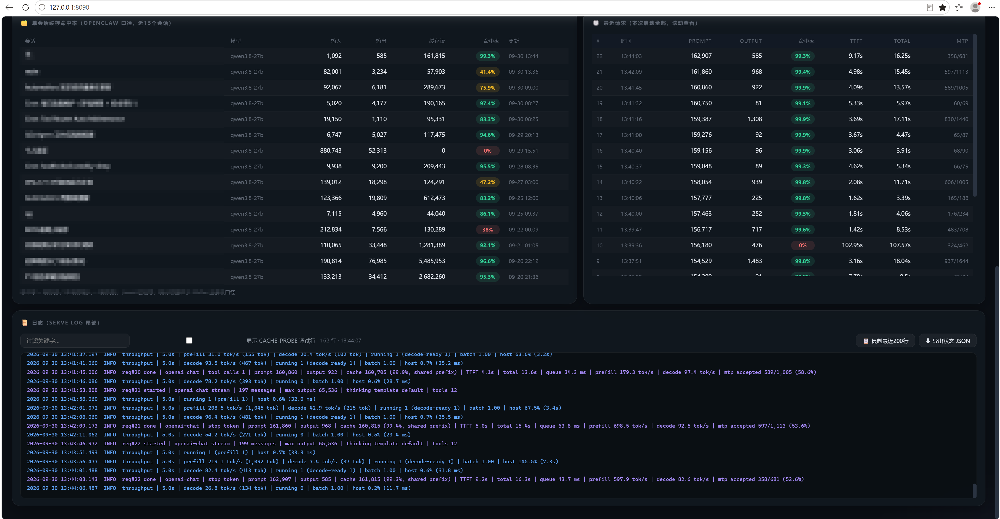

# NInfer Console

**NInfer 的一站式监控操作台 —— 单文件、纯 Python 标准库、零依赖。**

跑着本地大模型时，你通常要在终端、任务管理器、`nvidia-smi`、日志文件之间来回切换，才能回答"现在什么状态"。NInfer Console 把**所有和模型运行相关的内容放进一个浏览器页面**：引擎状态、显存/内存/CPU、速率曲线、用量统计、缓存命中率、日志、一键启停——5 秒自动刷新，不再切换窗口。

> 一个界面替代：终端 + 任务管理器 + nvidia-smi + `tail -f` 日志 + 看门狗脚本。





## 功能一览

| 区块 | 内容 |
|---|---|
| **服务** | 状态灯（运行 / **毒化** / 启动中 / 停止）+ 启动/停止/重启/开机自启按钮 + PID / 运行时长 / 重启计数 / RSS + 看门狗状态 |
| **GPU** | 显存条、利用率、温度、功耗、**累计耗电量**（功率×真实采样间隔积分，dashboard 重启不丢）；WSL2 下自动用 Windows 侧 `nvidia-smi`（机内读数不可信），并显示 Windows+WSL2 整机内存分色 |
| **主机** | 内存/CPU 占用曲线（1 小时窗口，服务端 5s 独立采样） |
| **引擎** | KV 容量、context cache（device active/cached、host states、private/shared 前缀、anchors）、host KV pinned/occupied、吞吐曲线（prefill/decode tok/s、running、batch） |
| **用量** | 输入/输出 token 总量、**总缓存命中率**、每小时趋势、MTP 接受率、最近请求明细（TTFT/排队/prefill/decode） |
| **单会话** | 每个会话的 input/output/cacheRead 与命中率（OpenClaw 集成，可选） |
| **未命中归因** | 缓存未命中**根因自动归因**：冷启动 / 长闲置 / 摘要失配 / 物理峰值 / 槽位不可用 / 小 owner 丢失 / 前缀分叉 + 证据链；prefix dump 深潜可定位**首个分叉 token**（需探针补丁引擎） |
| **操作** | 一键 start/stop/restart/enable、看门狗开关、控制台自启开关、日志查看（关键字过滤/探针行折叠）、**一键探针**（最小 chat 请求验证模型链路）、整页状态 JSON 导出 |

## 为什么值得用（设计亮点）

1. **零依赖**：纯 Python 标准库单文件（`server.py` + `page.html`），`python3 server.py` 即跑，无 pip 包、无前端框架、无数据库。对比 vLLM/SGLang 的 Grafana+Prometheus 全家桶，这是一条命令的监控台。
2. **毒化状态**：状态机区分 `active / poisoned / starting / stopped`——"进程在听但所有请求 503"（服务活着但全是 503）是 systemd 看不到的真实故障形态，这里是一等状态。
3. **服务端独立采样**：吞吐曲线由服务端 5s 线程采样，与浏览器轮询解耦——修掉了 Chrome 后台标签页 timer 节流把曲线退化成 1 点/分钟、尖峰全丢的问题。标签页挂着不刷，曲线照样完整。
4. **三源显存对账**：WSL 内 torch 读数不可信 → Windows 侧 `nvidia-smi` + serve 日志 free MiB + `/proc` 交叉验证，页面明示对账结果。
5. **缓存未命中深度归因**：业界控制台最多告诉你"命中率 87%"，这里回答"为什么这条没命中"——解析引擎探针日志的 8 道闸/STALE/PEAK/ENTRY 事件，把每次 miss 归因到具体根因；prefix dump 二进制帧扫描（71MB < 0.5s）定位首个分叉 token。
6. **工业级日志解析**：增量 offset 跟踪、截断/轮转检测、半行碎片处理、启动一次性行滚出尾窗后的全文件兜底+进程内缓存、单条坏记录不拖垮增量、单采集器挂掉不阻塞 `/api/status`。
7. **处处降级不黑屏**：D-Bus 不可用 → `/proc`+端口+`/health` 主判据；GPU 采样失败 → 明示错误不静默留旧值；OpenClaw 未装 → 会话卡片显示"未配置"；没有探针补丁 → 归因显示"无探针数据"。

## 环境要求

- **Python 3.9+**（标准库即可；3.11+ 自动用 `tomllib` 解析配置）
- **Linux**：裸 Linux 或 WSL2（GPU 采样自动探测：PATH 有 `nvidia-smi` 直接调；WSL2 自动走 Windows 侧 PowerShell 调 `nvidia-smi`）
- 一个运行中的 [NInfer](https://github.com/Neroued/ninfer) 引擎（或任意 OpenAI 兼容 HTTP 端点）

## 快速开始

```bash
# 1. 跑起来（默认 http://127.0.0.1:8090）
python3 server.py
# 或
bash restart.sh
# 或装 systemd user 单元（开机自启，推荐）
#    见 ninfer-dashboard.service.example

# 2. 浏览器打开 http://127.0.0.1:8090
#    （WSL2 下 Windows 侧浏览器直接用同一地址，localhost 自动转发）
```

引擎地址不是默认 `http://127.0.0.1:8081`？复制 `config.toml.example` 为 `config.toml`，改 `engine_url` 即可（全部可配项见该文件注释）。

## 配置

优先级：**环境变量 `NINFER_DASH_<KEY>`** > `config.toml`（与 `server.py` 同目录）> 内置默认。

| 键 | 默认 | 说明 |
|---|---|---|
| `dashboard_port` / `dashboard_bind` | `8090` / `127.0.0.1` | 控制台监听地址 |
| `engine_url` | `http://127.0.0.1:8081` | 引擎 HTTP 地址 |
| `service_unit` | `ninfer` | systemd user 单元名（一键操作） |
| `process_name` | `ninfer-serve` | 引擎二进制名（`/proc` 扫描） |
| `serve_log` / `request_jsonl` | `/tmp/ninfer-serve.log` / `/tmp/ninfer-req.jsonl` | 引擎日志路径 |
| `watchdog_*` / `prefix_dump` / `keep_stopped` / `energy_file` | 见 example | 各数据文件路径 |
| `gpu_mode` | `auto` | `auto` / `nvidia-smi` / `windows-powershell` |
| `sessions_source` | `openclaw` | `openclaw` / `off`（非 OpenClaw 用户设 off） |
| `probe_chat_template_kwargs` | `{}` | 探针的模型专属参数，如 `{ enable_thinking = false }` |

## 数据源与降级行为

| 数据源 | 用途 | 缺失时 |
|---|---|---|
| 引擎 `/health` `/v1/models` | 健康/毒化检测、模型信息 | 状态降级，不影响其他区块 |
| `nvidia-smi`（裸 Linux）/ Windows PowerShell（WSL2） | 显存/利用率/温度/功耗/耗电 | 明示错误，保留最后成功值 |
| `/proc/meminfo` `/proc/stat` | 主机内存/CPU | 恒有（Linux） |
| serve 日志固定格式行（capacity / context cache / host KV / throughput / req#done） | 引擎内部状态 | 对应卡片显示 — |
| 结构化请求日志（jsonl） | 用量/命中率/最近请求 | 卡片显示不可用 |
| `[CACHE-PROBE]` 探针行 + prefix dump（社区探针补丁） | 未命中深度归因 | 归因降级为"无探针数据" |
| OpenClaw agent sqlite（只读） | 单会话命中率 | 设 `sessions_source="off"` 或文件缺失时显示"未配置" |

## HTTP API

| 端点 | 说明 |
|---|---|
| `GET /api/status` | 全量聚合快照（所有区块数据） |
| `GET /api/logs?tail=200&q=关键词&hideprobe=1` | 日志尾窗（关键字过滤/探针行折叠） |
| `POST /api/action` `{"action":"start\|stop\|restart\|enable\|disable\|wd_enable\|wd_disable\|dash_boot_on\|dash_boot_off"}` | 服务操作（走 `systemctl --user`） |
| `POST /api/probe` | 一键探针（最小 chat 请求验证链路） |
| `GET /api/ping` | 存活探测 |

默认只绑 `127.0.0.1`——操作端点是本地控制面，**不要**在未加认证的情况下把端口暴露到网络。

## 测试

```bash
python3 tests/test_parsers.py
```

golden-file 单测覆盖：serve 日志全部固定格式行、jsonl 事件消费、探针归因、配置加载（`tomllib` + 老版本 fallback 解析器）。零依赖，CI 直接跑。

## 与 NInfer 上游的关系

本仓库是 NInfer 的**社区配套控制台**，不修改引擎本身。核心区块（状态/显存/吞吐/用量/命中率）依赖引擎自带的 HTTP 端点与日志格式，开箱即用；"未命中深度归因"与"prefix 深潜"依赖社区探针补丁（`GATE_SUMMARY`/`STALE_EXIT`/`PEAK_*`/`ENTRY_CLR`/`RES_SNAP` 日志行 + prefix dump 文件），未打补丁时自动降级。

## License

Apache-2.0（与 NInfer 上游一致）
